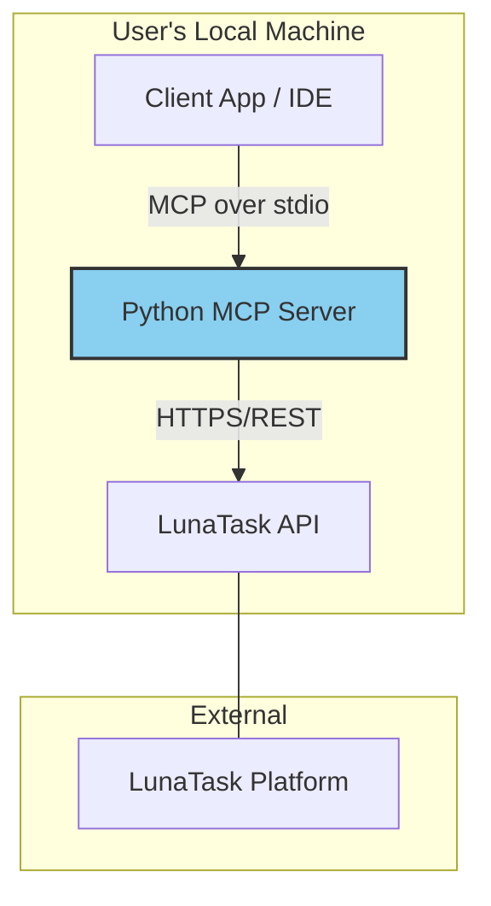

# 2. High Level Architecture

## Technical Summary

The system will be a lightweight, asynchronous Python application built using the **FastMCP** framework. It will function as a self-contained, monolithic service designed to be run locally by users as a background subprocess. The architecture prioritizes simplicity, low resource usage, and adherence to the MCP specification. It will handle concurrent I/O from a `stdio` transport layer and an external REST API (LunaTask) using Python's `asyncio` event loop. The design is explicitly crafted to be extensible for future additions, such as a Streamable HTTP transport and support for more LunaTask APIs.

## High Level Overview

The server's core architectural style is a **single, event-driven monolith**. This choice is dictated by the project's nature as a local, single-purpose utility. The repository will be a **Polyrepo** (a single repository), as there is no need for the complexity of a multi-repository setup.

The primary user interaction flow involves an external client (e.g., an IDE) launching the server as a subprocess. The client sends MCP requests over `stdio`, which the server parses and translates into authenticated HTTPS requests to the LunaTask API. The server then formats the response from LunaTask back into an MCP response and sends it to the client via `stdio`.

## Protocol Versioning
The server will declare its support for a specific version of the Model Context Protocol (e.g., `2025-06-18`). It **must** correctly handle the version negotiation phase of the initialization handshake with any connecting client. For the MVP, the server will support a single, current version of the protocol. The architecture should allow for easily updating this version or adding support for new versions in the future.

## High Level Project Diagram

## Architectural and Design Patterns

*   **Asynchronous I/O with `asyncio`**: This is the foundational pattern for handling network requests (to the LunaTask API) and `stdio` streams without blocking, ensuring the server remains responsive.
*   **Decorator-Based Configuration (via FastMCP)**: We will leverage decorators (`@mcp.tool`, `@mcp.resource`) to define the server's capabilities. _Rationale:_ This pattern, provided by the FastMCP framework, dramatically reduces boilerplate and keeps the business logic clean and declarative.
*   **Dependency Injection (for configuration/clients)**: The server's configuration and the HTTP client for LunaTask will be initialized once and made available to the MCP tools. _Rationale:_ This avoids global state and makes the tools easier to test in isolation.
*   **Repository Pattern (Conceptual)**: While not a formal database repository, the classes that interact with the LunaTask API will be separated from the MCP tool definitions. _Rationale:_ This separates the concern of "talking to LunaTask" from "handling MCP requests," improving modularity and testability.

---