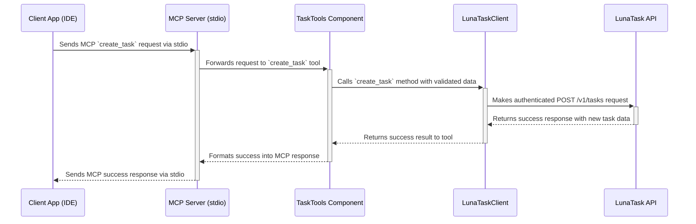

# 7. Core Workflows

This sequence diagram illustrates a typical "Create Task" workflow, showing how a request flows through the system from the client to the external API and back.

```mermaid
sequenceDiagram
    participant ClientApp as Client App (IDE)
    participant CoreServer as MCP Server (stdio)
    participant TaskTools as TaskTools Component
    participant LunaTaskClient as LunaTaskClient
    participant LunaTaskAPI as LunaTask API

    ClientApp->>+CoreServer: Sends MCP `create_task` request via stdio
    CoreServer->>+TaskTools: Forwards request to `create_task` tool
    TaskTools->>+LunaTaskClient: Calls `create_task` method with validated data
    LunaTaskClient->>+LunaTaskAPI: Makes authenticated POST /v1/tasks request
    LunaTaskAPI-->>-LunaTaskClient: Returns success response with new task data
    LunaTaskClient-->>-TaskTools: Returns success result to tool
    TaskTools-->>-CoreServer: Formats success into MCP response
    CoreServer-->>-ClientApp: Sends MCP success response via stdio
```

---