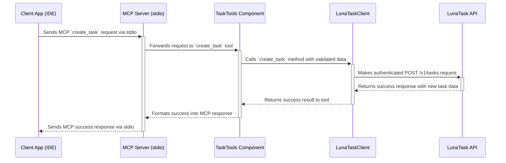

# 7. Core Workflows

This sequence diagram illustrates a typical "Create Task" workflow, showing how a request flows through the system from the client to the external API and back.



---

## Create Note Workflow

```mermaid
sequenceDiagram
    participant ClientApp as Client App (IDE)
    participant CoreServer as MCP Server (stdio)
    participant NotesTools as NotesTools Component
    participant LunaTaskClient as LunaTaskClient
    participant LunaTaskAPI as LunaTask API

    ClientApp->>+CoreServer: Sends MCP `create_note` request via stdio
    CoreServer->>+NotesTools: Forwards request to `create_note` tool
    NotesTools->>+LunaTaskClient: Calls `create_note` with validated payload
    LunaTaskClient->>+LunaTaskAPI: Makes authenticated POST /v1/notes request
    alt Duplicate detected (204 No Content)
        LunaTaskAPI-->>-LunaTaskClient: Returns empty body
        LunaTaskClient-->>-NotesTools: Returns `None`
        NotesTools-->>-CoreServer: Formats duplicate success response
    else Note created
        LunaTaskAPI-->>-LunaTaskClient: Returns wrapped note payload
        LunaTaskClient-->>-NotesTools: Returns `NoteResponse`
        NotesTools-->>-CoreServer: Formats success response with note_id
    end
    CoreServer-->>-ClientApp: Sends MCP response via stdio
```

---

## Update Note Workflow

```mermaid
sequenceDiagram
    participant ClientApp as Client App (IDE)
    participant CoreServer as MCP Server (stdio)
    participant NotesTools as NotesTools Component
    participant LunaTaskClient as LunaTaskClient
    participant LunaTaskAPI as LunaTask API

    ClientApp->>+CoreServer: Sends MCP `update_note` request (note_id, optional fields)
    CoreServer->>+NotesTools: Forwards request to `update_note` tool
    NotesTools->>NotesTools: Validates at least one field provided
    NotesTools->>NotesTools: Validates date_on format if provided
    alt Validation fails
        NotesTools-->>-CoreServer: Returns validation_error payload
        CoreServer-->>-ClientApp: Emits MCP error response via stdio
    else Valid update
        NotesTools->>+LunaTaskClient: Calls update_note with NoteUpdate
        LunaTaskClient->>+LunaTaskAPI: Makes authenticated PUT /v1/notes/{id} request
        alt Note not found (404)
            LunaTaskAPI-->>-LunaTaskClient: Returns 404 error
            LunaTaskClient-->>-NotesTools: Raises LunaTaskNotFoundError
            NotesTools-->>-CoreServer: Returns not_found_error payload
            CoreServer-->>-ClientApp: Emits MCP error response via stdio
        else Note updated successfully
            LunaTaskAPI-->>-LunaTaskClient: Returns wrapped note payload
            LunaTaskClient-->>-NotesTools: Returns NoteResponse
            NotesTools-->>-CoreServer: Formats success payload with note_id
            CoreServer-->>-ClientApp: Sends MCP success response via stdio
        end
    end
```

---

## Delete Note Workflow

```mermaid
sequenceDiagram
    participant ClientApp as Client App (IDE)
    participant CoreServer as MCP Server (stdio)
    participant NotesTools as NotesTools Component
    participant LunaTaskClient as LunaTaskClient
    participant LunaTaskAPI as LunaTask API

    ClientApp->>+CoreServer: Sends MCP `delete_note` request (note_id)
    CoreServer->>+NotesTools: Forwards request to `delete_note` tool
    NotesTools->>NotesTools: Validates note_id not empty/whitespace
    alt Validation fails
        NotesTools-->>-CoreServer: Returns validation_error payload
        CoreServer-->>-ClientApp: Emits MCP error response via stdio
    else Valid note_id
        NotesTools->>+LunaTaskClient: Calls delete_note with note_id
        LunaTaskClient->>+LunaTaskAPI: Makes authenticated DELETE /v1/notes/{id} request
        alt Note not found (404)
            LunaTaskAPI-->>-LunaTaskClient: Returns 404 error
            LunaTaskClient-->>-NotesTools: Raises LunaTaskNotFoundError
            NotesTools-->>-CoreServer: Returns not_found_error payload
            CoreServer-->>-ClientApp: Emits MCP error response via stdio
        else Note deleted successfully
            LunaTaskAPI-->>-LunaTaskClient: Returns wrapped note payload with deleted_at
            LunaTaskClient-->>-NotesTools: Returns NoteResponse
            NotesTools-->>-CoreServer: Formats success payload with deleted_at
            CoreServer-->>-ClientApp: Sends MCP success response via stdio
        end
    end
```

---

## Daily Journal Workflow

```mermaid
sequenceDiagram
    participant ClientApp as Client App (IDE)
    participant CoreServer as MCP Server (stdio)
    participant JournalTools as JournalTools Component
    participant LunaTaskClient as LunaTaskClient
    participant LunaTaskAPI as LunaTask API

    ClientApp->>+CoreServer: Sends MCP `create_journal_entry` request (date_on, name, content)
    CoreServer->>+JournalTools: Forwards request to `create_journal_entry` tool
    JournalTools->>JournalTools: Validates ISO-8601 `date_on` input
    alt Invalid date format
        JournalTools-->>-CoreServer: Returns validation_error payload
        CoreServer-->>-ClientApp: Emits MCP error response via stdio
    else Valid date
        JournalTools->>+LunaTaskClient: Calls create_journal_entry with JournalEntryCreate
        LunaTaskClient->>+LunaTaskAPI: Makes authenticated POST /v1/journal_entries request
        LunaTaskAPI-->>-LunaTaskClient: Returns wrapped journal entry payload
        LunaTaskClient-->>-JournalTools: Returns JournalEntryResponse
        JournalTools-->>-CoreServer: Formats success payload with journal_entry_id
        CoreServer-->>-ClientApp: Sends MCP success response via stdio
    end
```

---
