# TaskTools tests modularization plan

Objective
- Split monolithic tests/test_task_tools.py into focused files under 500 lines, preserving behavior and coverage.
- Keep tests flat under tests/, add tests/factories.py, move pagination unit tests into tests/test_api_client.py.
- Keep it simple; no implementation changes.

Inputs
- Source tests: [tests/test_task_tools.py](tests/test_task_tools.py)
- Documentation to adjust: [docs/architecture/8-source-tree.md](docs/architecture/8-source-tree.md), [docs/architecture/11-coding-standards.md](docs/architecture/11-coding-standards.md), [CLAUDE.md](CLAUDE.md)

Planned split (target files)
- [tests/test_task_tools_init_and_registration.py](tests/test_task_tools_init_and_registration.py)
- [tests/test_task_tools_resource_list.py](tests/test_task_tools_resource_list.py)
- [tests/test_task_tools_resource_single.py](tests/test_task_tools_resource_single.py)
- [tests/test_task_tools_resource_e2e.py](tests/test_task_tools_resource_e2e.py)
- [tests/test_task_tools_create_tool.py](tests/test_task_tools_create_tool.py)
- [tests/test_task_tools_create_tool_e2e.py](tests/test_task_tools_create_tool_e2e.py)
- [tests/test_task_tools_update_tool.py](tests/test_task_tools_update_tool.py)
- [tests/test_task_tools_delete_tool.py](tests/test_task_tools_delete_tool.py)
- Move pagination tests into: [tests/test_api_client.py](tests/test_api_client.py)
- Shared builders in: [tests/factories.py](tests/factories.py)

Constraints and principles
- Preserve functionality and coverage; no changes to implementation.
- Each test file under 500 lines.
- Minimal fixtures; prefer explicit construction; factories only if they reduce duplication.
- Prefer function-scoped fixtures; avoid autouse fixtures unless essential.

Numbered, trackable tasks
- [x] T01 Create shared factories module at [tests/factories.py](tests/factories.py) with small builders for TaskResponse and Source.
- [x] T02 Add minimal reusable fixtures in [tests/conftest.py](tests/conftest.py) only if needed: mcp, config, client, task_tools, async ctx.
- [x] T03 Create [tests/test_task_tools_init_and_registration.py](tests/test_task_tools_init_and_registration.py); move TestTaskToolsInitialization and registration/discoverability assertions.
- [x] T04 Create [tests/test_task_tools_resource_list.py](tests/test_task_tools_resource_list.py); move TestTaskResourceRetrieval and TestTaskResourceErrorHandling.
- [x] T05 Create [tests/test_task_tools_resource_single.py](tests/test_task_tools_resource_single.py); move TestSingleTaskResource.
- [x] T06 Create [tests/test_task_tools_resource_e2e.py](tests/test_task_tools_resource_e2e.py); move TestEndToEndResourceValidation.
- [x] T07 Create [tests/test_task_tools_create_tool.py](tests/test_task_tools_create_tool.py); move TestCreateTaskTool.
- [x] T08 Create [tests/test_task_tools_create_tool_e2e.py](tests/test_task_tools_create_tool_e2e.py); move TestCreateTaskToolEndToEnd.
- [x] T09 Create [tests/test_task_tools_update_tool.py](tests/test_task_tools_update_tool.py); move TestUpdateTaskTool.
- [x] T10 Create [tests/test_task_tools_delete_tool.py](tests/test_task_tools_delete_tool.py); move TestDeleteTaskTool.
- [x] T11 Create [tests/test_task_tools_pagination.py](tests/test_task_tools_pagination.py); move TestTaskToolsPaginationAndFiltering
- [x] T12 Remove monolithic [tests/test_task_tools.py](tests/test_task_tools.py) after parity is confirmed.
- [x] T13 Verify each new test file is under 500 lines; if approaching the limit, split further by concern.
- [x] T14 Run ruff format and ruff check --fix.
- [x] T15 Run pyright and resolve any typing issues in tests.
- [x] T16 Run pytest and fix any fixture/import issues; ensure full suite green.
- [x] T17 Update [docs/architecture/8-source-tree.md](docs/architecture/8-source-tree.md) to reflect multiple test files.
- [x] T18 Fix stray character and clarify test file limit in [docs/architecture/11-coding-standards.md](docs/architecture/11-coding-standards.md) (≤500 lines applies to tests).
- [x] T19 Update contributor guidance in [CLAUDE.md](CLAUDE.md) with a short section on splitting large test modules and using simple factories/fixtures.
- [x] T20 Verify CI passes with the refactored layout and docs.
- [x] T21 Add pytest markers and repository config: mark integration/E2E tests and register markers in [pytest.ini](pytest.ini) or pyproject to avoid unknown-marker warnings.
- [x] T22 Add repository constraint test at [tests/test_repo_constraints.py](tests/test_repo_constraints.py) to assert each test file has ≤500 lines.
- [x] T23 Add coverage measurement to CI and enforce a minimum threshold equal to current baseline; fail on coverage drop.
- [x] T24 Adjust CI to run unit tests by default and run integration/E2E (marked) in a separate job or schedule.
- [x] T25 Expand T19 into a short section in [CLAUDE.md](CLAUDE.md) with explicit guidance: split test modules by concern before 500 lines, prefer explicit construction, use factories only to reduce duplication, keep fixtures minimal and function-scoped.
- [x] T26 Post-split audit: ensure no TaskResponse tests assert encrypted fields (name, note) per [docs/architecture/6-external-apis.md](docs/architecture/6-external-apis.md).

Acceptance criteria
- All moved tests pass unchanged in behavior.
- Each new test file is well under 500 lines.
- Ruff and pyright pass.
- Documentation reflects the new structure.
- No coverage regression relative to pre-split baseline.
- Unit and integration/E2E markers are correctly applied.

Mermaid overview

```mermaid
graph TD
    A[tests_test_task_tools_py] --> B[tests_test_task_tools_init_and_registration_py]
    A[tests_test_task_tools_py] --> C[tests_test_task_tools_resource_list_py]
    A[tests_test_task_tools_py] --> D[tests_test_task_tools_resource_single_py]
    A[tests_test_task_tools_py] --> E[tests_test_task_tools_resource_e2e_py]
    A[tests_test_task_tools_py] --> F[tests_test_task_tools_create_tool_py]
    A[tests_test_task_tools_py] --> G[tests_test_task_tools_create_tool_e2e_py]
    A[tests_test_task_tools_py] --> H[tests_test_task_tools_update_tool_py]
    A[tests_test_task_tools_py] --> I[tests_test_task_tools_delete_tool_py]
    A[tests_test_task_tools_py] --> J[tests_test_api_client_py]
    K[tests_factories_py_and_tests_conftest_py] --> B[tests_test_task_tools_init_and_registration_py]
    K[tests_factories_py_and_tests_conftest_py] --> C[tests_test_task_tools_resource_list_py]
    K[tests_factories_py_and_tests_conftest_py] --> D[tests_test_task_tools_resource_single_py]
    K[tests_factories_py_and_tests_conftest_py] --> E[tests_test_task_tools_resource_e2e_py]
    K[tests_factories_py_and_tests_conftest_py] --> F[tests_test_task_tools_create_tool_py]
    K[tests_factories_py_and_tests_conftest_py] --> G[tests_test_task_tools_create_tool_e2e_py]
    K[tests_factories_py_and_tests_conftest_py] --> H[tests_test_task_tools_update_tool_py]
    K[tests_factories_py_and_tests_conftest_py] --> I[tests_test_task_tools_delete_tool_py]
    K[tests_factories_py_and_tests_conftest_py] --> J[tests_test_api_client_py]
```

Notes and guardrails
- No changes to implementation modules during this refactor.
- Prefer direct object construction; use factories only where they reduce duplication.
- Keep fixtures minimal to avoid over-abstraction.
- Preserve all assertions and coverage; organizational refactor only.

References
- Architecture source tree: [docs/architecture/8-source-tree.md](docs/architecture/8-source-tree.md)
- Coding standards: [docs/architecture/11-coding-standards.md](docs/architecture/11-coding-standards.md)
- Contributor guidance: [CLAUDE.md](CLAUDE.md)